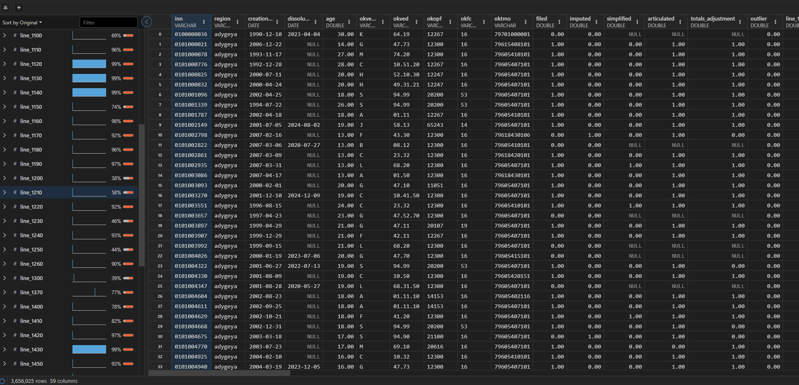
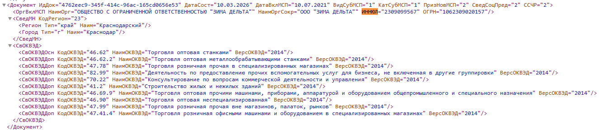
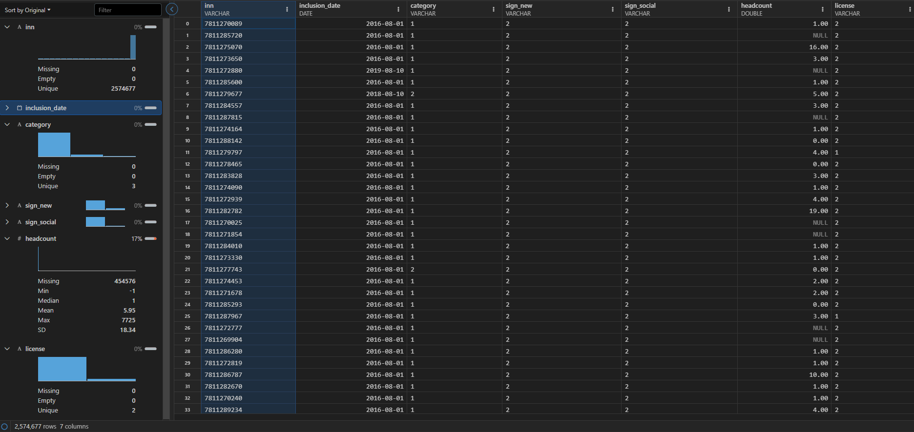
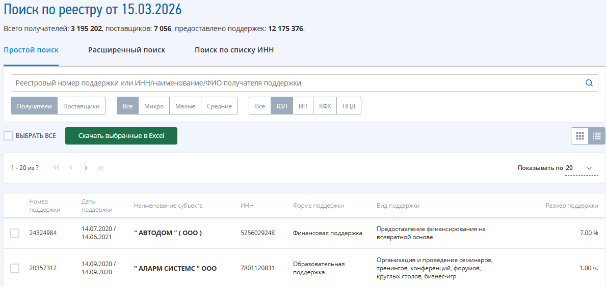
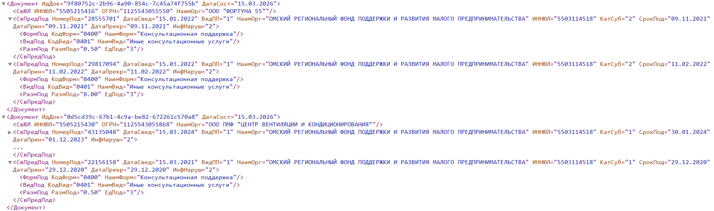

```{r, include=FALSE}
#| label: setup
#| eval: false

library(arrow)
library(dplyr)
library(ggplot2)
library(lubridate)
library(knitr)
library(patchwork)
```

```{r }
#| label: load-msp-data
#| eval: false

ds <- open_dataset("../Data/MSP_parsed", partitioning = c("year", "month"))

cat_data <- ds %>%
  group_by(year, month, category) %>%
  summarise(count = n()) %>%
  collect() %>%
  mutate(date = make_date(year, month, 1),
         category = case_when(
           category == "1" ~ "Микро",
           category == "2" ~ "Малое",
           category == "3" ~ "Среднее"
         ))
        
micro_data <- cat_data %>% filter(category == "Микро")
small_data <- cat_data %>% filter(category == "Малое")
medium_data <- cat_data %>% filter(category == "Среднее")

total_data <- cat_data %>%
  group_by(date) %>%
  summarise(total = sum(count, na.rm = TRUE))

```

## Источники, методология сбора, подготовки и анализа данных.

### Анализ данных. Экономическая модель.

Причинно - следственные связи оказываемых мер поддержки и финансового состояния фирм. DAG.

```{mermaid}

%%| fig-align: center
%%| fig-responsive: false

graph TD
  A[Размер фирмы]
  B[Отрасль]
  C[Регион]
  D[Состояние <br/> экономики]
  E[Специальный <br/> статус]

  F[Господдержка]

  G[Структура <br/> капитала]
  H[Управление]

  K[Финансовая <br/> устойчивость]

  A --> G
  A --> H
  A --> K
  A --> F

  B --> K
  B --> G
  B --> F
  B --> H

  C --> F
  C --> K

  D --> F
  D --> K

  E --> F
  E --> H

  F --> G
  F --> H

  G --> K

  H --> K

  classDef treatment fill:#F18F01,stroke:#1F2A5A,stroke-width:2px,color:#fff;
  classDef outcome fill:#2E86AB,stroke:#1F2A5A,stroke-width:2px,color:#fff;
  
  class F treatment;
  class K outcome;
```

---

### Анализ данных. Инструменты Causal Inference.

1. Оценка ATT с помощью DiD с динамическим лечением (разнопериодным) Staggered DiD [@callaway2021].

2. Оценка ATE (CATE), анализ интенсивности воздействия с помощью Dynamic (Continuous Treatment) DoubleML  [@bodory2022].

3. CATE, исследование факторов гетерогенности и распределения эффектов с помощью Causal Forest [@athey2019grf; @zheng2023causal].

### Анализ данных. Проверка робастности:
- плацебо - тесты;
- альтернативные переменные воздействия (ROA, коэффициент текущей ликвидности, Z - счет Альтмана);
- синтетические контрфакты SCM-ITE [@abadie2021synthetic; @dube2023individual].

## Источники данных. Российская база бухгалтерской отчетности (РББО).

Датасет содержит информацию из бухгалтерской отчетности всех российских фирм за 2011–2024 гг.

*   **Источник:** Лаборатория исследования судебной практики ИПП ЕУСПб
*   **Публикация:** Bondarkov, Ledenev, Skougarevskiy [@bondarkov2025rfsd].

:::: {.columns}

::: {.column width="50%"}
- 4 - 4.4 млн. фирм/год;
- уникальные идентификаторы фирм ИНН, ОГРН;
- полные описания фирм (название, коды учета, отрасль, дата создания и ликвидации, геоданные и т.д.);
- все строки полной бухгалтерской отчетности.
:::

::: {.column width="50%"}
{fig-align="center" width="60%"}
:::

::::

---

### Выборка данных из РББО
Записи(фирмы):

- обязаны предоставлять ежегодную бухгалтерскую отчетность;
- нефинансовые организации;
- однозначно идентифицируются;
- пересекаются со временем существования реестра МСП (2017:2024). 

Признаки(переменные):

- ИНН;
- основной ОКВЭД;
- регион;
- биография фирмы;
- данные бухгалтерского баланса и отчета о финансовых результатах.

---

{fig-align="center" width="80%"}


## Единый реестр МСП 
[@fns_opendata_rsmp]

- данные ретроспективные, c 2016 года;
- месячные;
- существуют только в виде сжатых архивов .xml на сайте ФНС.

{fig-align="center" width="100%"}

---

{fig-align="center" width="100%"}

## Динамика количества фирм в едином реестре МСП по категориям.

```{r}
#| label: Category graphes
#| eval: false

p1 <- ggplot(micro_data, aes(x = date, y = count, color = category)) +
  geom_line(size = 1) +
  geom_smooth(color = "#C73E1D", fill = "#F18F01", alpha = 0.2) + 
  labs(x = NULL, y = "Количество фирм", color = "Категория") +
  scale_x_date(date_breaks = "1 year", date_labels = "%Y") +
  scale_y_continuous(labels = scales::comma) +
  scale_color_manual(values = "#4C9A8A") +
  theme_minimal(base_size = 12)

p2 <- ggplot(small_data, aes(x = date, y = count, color = category)) +
  geom_line(size = 1) +
  geom_smooth(color = "#C73E1D", fill = "#F18F01", alpha = 0.2) + 
  labs(x = NULL, y = "Количество фирм", color = "Категория") +
  scale_x_date(date_breaks = "1 year", date_labels = "%Y") +
  scale_y_continuous(labels = scales::comma) +
  scale_color_manual(values = "#4C9A8A") +
  theme_minimal(base_size = 12)

p3 <- ggplot(medium_data, aes(x = date, y = count, color = category)) +
  geom_line(size = 1) +
  geom_smooth(color = "#C73E1D", fill = "#F18F01", alpha = 0.2) +
  labs(x = NULL, y = "Количество фирм", color = "Категория") +
  scale_x_date(date_breaks = "1 year", date_labels = "%Y") +
  scale_y_continuous(labels = scales::comma) +
  scale_color_manual(values = "#4C9A8A") +
  theme_minimal(base_size = 12)

 p1 / p2 / p3 

```

## Динамика общего количества фирм в едином реестре МСП

```{r}
#| label: Total graph
#| eval: false

p_all <- ggplot(total_data, aes(x = date, y = total)) +
  geom_line(color = "#1F2A5A", size = 1.2) +  # фирменный синий
  geom_smooth(color = "#C73E1D", fill = "#F18F01", alpha = 0.2) +
  labs(x = NULL, y = "Количество фирм") +
  scale_x_date(date_breaks = "1 year", date_labels = "%Y") +
  scale_y_continuous(labels = scales::comma) +
  theme_minimal(base_size = 14) +
  theme(plot.title = element_text(face = "bold", hjust = 0.5))

p_all

```

## Количество новых фирм

```{r}
#| label: New and social graphes
#| eval: false

new_data <- ds %>%
  filter(sign_new == "1") %>%
  group_by(year, month) %>%
  summarise(new = n()) %>%
  collect() %>%
  mutate(date = make_date(year, month, 1))

if (nrow(new_data) > 0) {
  p_new <- ggplot(new_data, aes(x = date, y = new)) +
    geom_line(color = "#1F2A5A", size = 1.2) +
    geom_smooth(color = "#C73E1D", fill = "#F18F01", alpha = 0.2) + 
    labs(x = NULL, y = "Количество новых фирм") +
    scale_x_date(date_breaks = "1 year", date_labels = "%Y") +
    scale_y_continuous(labels = scales::comma) +
    theme_minimal(base_size = 12)
}

p_new
```

## Реестр субъектов МСП - получателей поддержки

[@fns_opendata_support]

{fig-align="center" width="90%"}

---

- реестр ведется и публикуется с 2021 года;
- cодержит данные о видах, объемах, сроках, поставщиках поддержки юридических лиц, ИП и самозанятых;
- месячные данные.

{fig-align="center" width="100%"}

## Переменные

#### Зависимая переменная (Y)

1. Отдельные финансовые показатели: коэффициент текущей ликвидности, коэффициент автономии, ROA, оборачиваемость активов, динамика выручки (прибыли).
2. Интегральные оценки финансового состояния фирм: Z - счет Альтмана, балльные оценки.
3. Интегральный индекс финансовой устойчивости (FSI): агрегирование фактической информации по отдельным финансовым показателям с помощью метода главных компонент (PCA).

---

#### Переменные воздействия (Treatment):
1. Бинарные индикаторы по видам поддержки.
2. Непрерывные показатели объема поддержки.

#### Ковариаты:
1. Характеристики фирмы: возраст, местоположение, ССЧР, отрасль (ОКВЭД), наличие специального статуса, длительность нахождения в МСП, последовательность и полнота бухгалтерской отчетности.
2. Экзогенные факторы: отраслевые индексы деловой активности.


## Список источников {#refs}

::: {#refs}
:::

